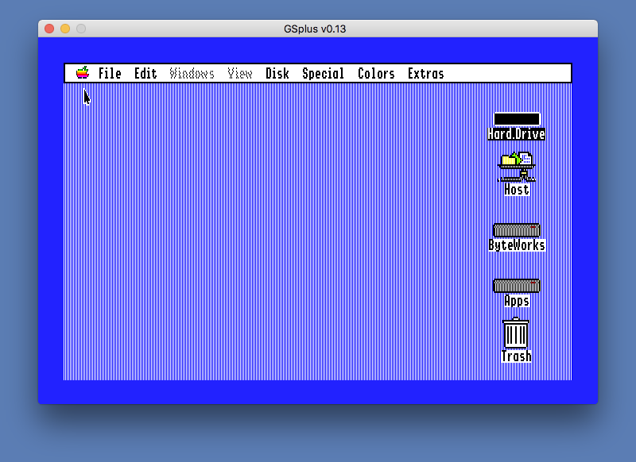
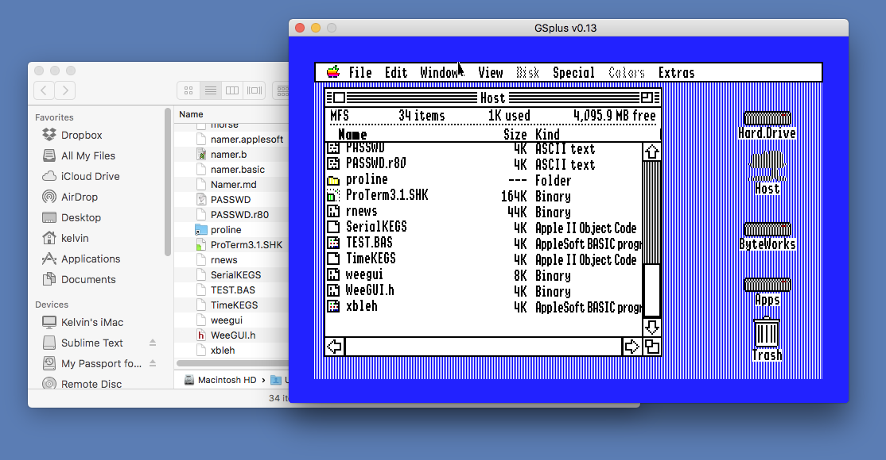

Host FST
--------

This is a file system translator (and driver) for compatible Apple IIgs
emulators.  It depends on emulator support (but should not cause problems
if run on real hardware or an unsupportive emulator).

This FST exposes a shared folder from your native file system as a volume 
within GS/OS.  (The volume will not be available from ProDOS 8). Reading 
or writing a file on the :Host drive will read or write the file directly 
on the native file system.  File Types, Finder Info, and Resource Forks 
are supported.

In general any software that works with the HFS FST should work with the 
Host FST.

